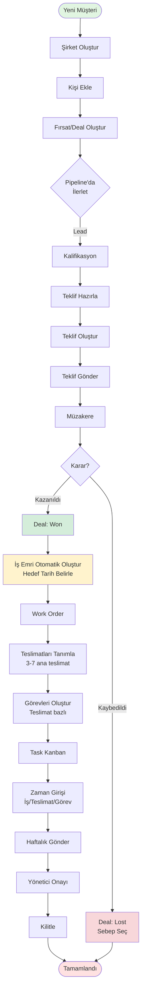
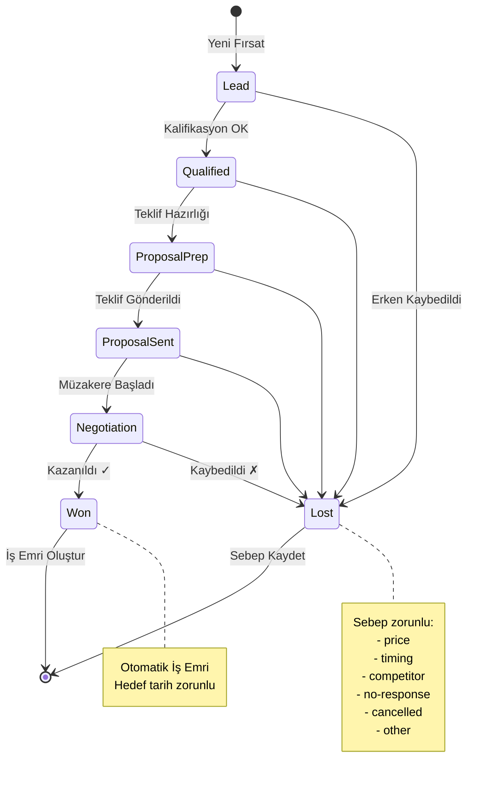
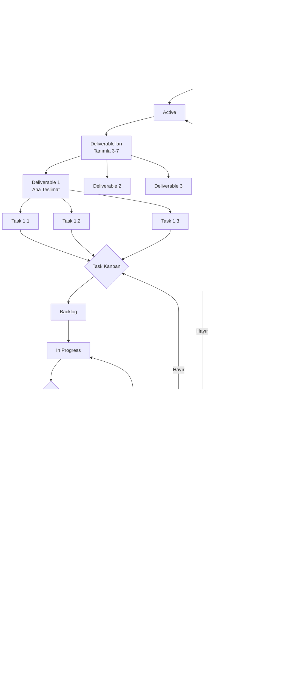
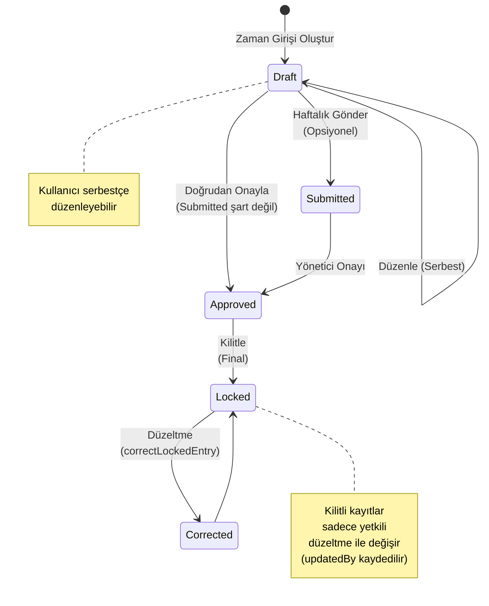
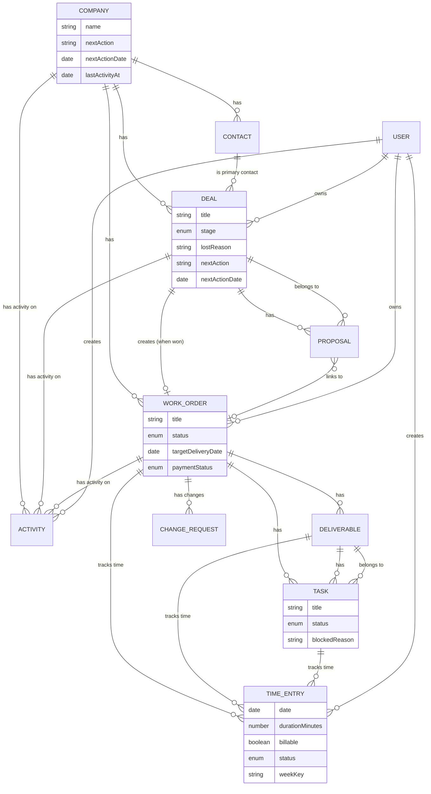
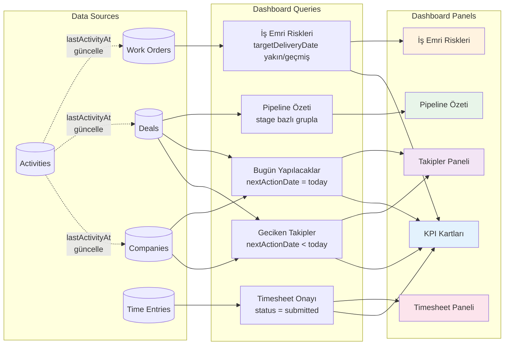

# **Ajans CRM ve İş Takip Uygulaması \- Ürün Tasarım Dokümanı (MVP Odaklı)**

**Tarih:** 03.02.2026
**Versiyon:** 2.5 (İş Akışı Diagramları Eklendi)
**Durum:** Geliştirme - MVP Tamamlandı
**Sektör:** Yazılım Geliştirme & Dijital Ajans

> Bu doküman, “ileri düzey teknik özellikler” yerine ajansların günlük satış ve müşteri süreçlerini **daha düzenli, takip edilebilir ve kayıpsız** yönetmesini hedefleyen iş odaklı bir tasarım dokümanıdır.

## **1. Proje Özeti ve Vizyon**

Uygulama; yazılım geliştirme hizmeti veren firmaların **müşteri ilişkileri (CRM)**, **teklif yönetimi**, **iş emri / teslimat takibi**, **zaman kaydı** ve **iletişim geçmişini** tek yerde toplar.

Amaç “her şeyi yapmak” değil; ajansın en çok zorlandığı 3 noktayı netleştirmektir:

- **Unutulan takipler** (müşteriye dönüş yapılmadı, teklif askıda kaldı)
- **Dağınık iletişim** (notlar WhatsApp/e-posta/defter arasında kayboldu)
- **İşlerin teslimata dönüşmemesi** (kazanılan işin kapsamı belirsiz, görevler dağınık)

### **1.1. Temel Prensipler**

- **Next Action (Sonraki Aksiyon) odaklı CRM**: Her müşteri/iş için tek bir “sonraki adım” net olmalı.
- **Tek Activity Feed**: Görüşme, not, dosya, karar ve sonraki adım tek akışta toplanmalı.
- **İş Emri + Teslimat (Deliverable)**: Kazanılan iş “proje” olmak zorunda değil; önce “iş emri” açılır, içinde 3-7 ana teslimat tanımlanır.
- **Basit kanban**: Ajans için karmaşık sprint/R&D yerine, işin akışını görünür kılan basit durumlar.

### **1.2. Kapsam (MVP)**

MVP’nin hedefi: “Müşteri → teklif → iş → teslimat → zaman kaydı” hattını **uçtan uca** çalıştırmak.

- Şirket/Kişi yönetimi
- Satış hunisi (Deal/Pipeline)
- Teklif (kalem, iskonto, KDV, versiyon, PDF)
- İş Emri (Work Order) + Teslimatlar + Görevler
- Activity Feed (iletişim ve notlar)
- Zaman girişi (basit timesheet) + onay/kilitleme

### **1.3. Opsiyonel (MVP Dışı)**

Bu özellikler istenirse sonraya bırakılır:

- Git entegrasyonları ve otomasyonları
- Gantt/timeline ile kaynak planlama
- Offline-first / PWA (kullanıcı ihtiyacına göre)

## **2. Teknoloji Yığını (Basit ve Yeterli)**

- **Frontend**: Next.js 14+ (App Router), TypeScript  
- **UI**: Tailwind CSS + shadcn/ui (ve mevcut bileşen seti)  
- **Backend**: Firebase (Auth + Firestore + Storage)  
- **PDF**: `@react-pdf/renderer` (tek yol seçimi)  
- **Deploy**: Vercel

> Not: Uygulama ölçeği büyümedikçe “ekstra altyapı” hedeflenmez. Öncelik; ekranlar ve iş akışının doğruluğudur.

## **3. İş Akışları (Mutlaka Net Olmalı)**

### **3.1. Satış Akışı: Lead → Deal → Teklif → Kazan/Kaybet**

Kurallar:

- Deal açılmadan şirket/kontak seçilir (ya da hızlıca eklenir).
- Teklif “Gönderildi” olmadan “Kazanıldı” yapılabilir; ancak **Kazanıldı** seçildiğinde sistem kullanıcıyı uyarır:
  - “Teklif kabul kaydı oluşturulsun mu?” (kabul tarihi + kabul eden kişi)
- “Kaybedildi” durumunda **sebep zorunlu**: `price | timing | competitor | no-response | cancelled | other`

### **3.2. Operasyon Akışı: Kazanıldı → İş Emri → Teslimatlar → Görevler**

- Deal kazanıldığında otomatik **Work Order** açılır.
- Work Order içinde 3-7 ana teslimat (Deliverable) tanımlanır.
- Görevler teslimata bağlanır (teslimatsız görev “istisna”).
- Basit kanban: `backlog | in-progress | blocked | done`
- “Blocked” için **sebep zorunlu**: `waiting-client | internal-approval | payment | dependency | other`

### **3.3. CRM Takip Akışı: Next Action + Activity**

Her şirket ve her deal için:

- **`nextAction`** (metin)
- **`nextActionDate`** (tarih)
- **`ownerId`** (sorumlu)

Dashboard temel hedefi: “Bugün yapılacaklar, gecikenler, bu hafta yaklaşanlar”.

### **3.4. Zaman Takibi (Basit Timesheet)**

- Zaman kaydı alanları: tarih, süre (dk), iş emri/deliverable/görev bağlama, açıklama, `billable` (E/H).
- Haftalık dönem kapanışı: "Onayla ve kilitle".
- Kilitli kayıt değişecekse "düzeltme kaydı" (not + kim + ne zaman).

### **3.5. İş Akışı Diagramları (Görsel Referans)**

Bu bölüm, yukarıdaki iş akışlarını görsel olarak açıklar ve kullanıcının sistemi anlamasını kolaylaştırır.

#### **3.5.1. Genel Uçtan Uca İş Akışı**



**Açıklama:**
- Her aşamada **Activity Feed** ile iletişim kaydedilir
- Her nesne üzerinde **Next Action** tanımlanır
- Dashboard'da gecikmiş/yaklaşan takipler görünür

#### **3.5.2. Deal Pipeline Durum Akışı**



#### **3.5.3. Work Order ve Operasyon Akışı**



**Blocked Sebepleri:**
- `waiting-client`: Müşteri bekleniyor
- `internal-approval`: İç onay bekleniyor
- `payment`: Ödeme bekleniyor
- `dependency`: Bağımlılık var
- `other`: Diğer

#### **3.5.4. Timesheet Durum Akışı**



#### **3.5.5. Veri İlişkileri ve Bağımlılıklar**



**Temel İlişki Kuralları:**
1. **Company → Deal**: Bir şirketin birden fazla fırsatı olabilir
2. **Deal → Proposal**: Bir fırsatın birden fazla teklifi (versiyon) olabilir
3. **Deal (Won) → Work Order**: Kazanılan her fırsat **otomatik** bir iş emri oluşturur
4. **Work Order → Deliverable → Task**: Hiyerarşik yapı (3 seviye)
5. **Time Entry**: Work Order, Deliverable veya Task'a bağlanabilir
6. **Activity**: Company, Deal veya Work Order üzerinde oluşturulur
7. **Next Action**: Company, Deal ve Work Order'da bulunur (takip disiplini)

#### **3.5.6. Dashboard Veri Akışı**



**Dashboard Mantığı:**
- Her panel **limitli sorgu** ile yüklenir (performans)
- `lastActivityAt` alanı **denormalize** edilir (write sırasında güncellenir)
- Smart Nudge'lar basit kurallara dayanır (AI değil, tarih/durum kontrolü)

## **4. Veri Modeli (Firestore)**

> Amaç; raporlanabilir, basit ve tutarlı bir model. “Her alanı en baştan koymak” yerine, MVP’yi taşıyan alanlar tanımlanır.

### **4.1. Ortak Alanlar**

Tüm koleksiyonlarda önerilen alanlar:

- `createdAt`, `updatedAt` (timestamp)
- `createdBy`, `updatedBy` (ref/users veya uid)
- `isArchived` (boolean)

### **4.2. Koleksiyonlar**

#### **companies (Müşteri Şirketleri)**

```json
{
  "id": "auto-id",
  "name": "string",
  "status": "active | inactive",
  "ownerId": "ref(users)",
  "nextAction": "string",
  "nextActionDate": "timestamp",
  "lastActivityAt": "timestamp",
  "tags": ["string"]
}
```

#### **contacts (Kişiler)**

```json
{
  "id": "auto-id",
  "companyId": "ref(companies)",
  "fullName": "string",
  "title": "string",
  "email": "string",
  "phone": "string",
  "isPrimary": "boolean",
  "notes": "string"
}
```

#### **deals (Satış Fırsatları / Pipeline Kartı)**

**MVP kuralı:** Deal açarken `primaryContactId` (**contact**) zorunludur.

```json
{
  "id": "auto-id",
  "companyId": "ref(companies)",
  "primaryContactId": "ref(contacts)",
  "title": "string",
  "stage": "lead | qualified | proposal-prep | proposal-sent | negotiation | won | lost",
  "lostReason": "price | timing | competitor | no-response | cancelled | other",
  "expectedCloseDate": "timestamp",
  "estimatedBudgetMinor": "number",
  "currency": "TRY | USD | EUR",
  "ownerId": "ref(users)",
  "nextAction": "string",
  "nextActionDate": "timestamp",
  "lastActivityAt": "timestamp"
}
```

#### **catalog_items (Hizmet/Kalem Kataloğu)**

> Katalog opsiyonel ama tutarlılık için önerilir.

```json
{
  "id": "auto-id",
  "name": "string",
  "type": "service | product | license",
  "unit": "hour | day | month | piece | project",
  "defaultUnitPriceMinor": "number",
  "currency": "TRY | USD | EUR",
  "taxRate": "number",
  "isActive": "boolean",
  "description": "string"
}
```

#### **proposals (Teklifler)**

Karar: Para alanları “minor unit” (kuruş/cent) tutulur.

```json
{
  "id": "auto-id",
  "dealId": "ref(deals)",
  "companyId": "ref(companies)",
  "version": "number",
  "status": "draft | sent | accepted | rejected",
  "currency": "TRY | USD | EUR",
  "pricesIncludeTax": "boolean (default: true)",
  "items": [
    {
      "catalogItemId": "ref(catalog_items)",
      "title": "string",
      "description": "string",
      "quantity": "number",
      "unit": "hour | day | month | piece | project",
      "unitPriceMinor": "number",
      "taxRate": "number"
    }
  ],
  "subtotalMinor": "number",
  "taxTotalMinor": "number",
  "grandTotalMinor": "number",
  "sentAt": "timestamp",
  "acceptedAt": "timestamp",
  "acceptedByName": "string",
  "acceptanceNote": "string"
}
```

#### **work_orders (İş Emirleri)**

> “Proje” yerine “iş emri”: ajans işi doğrudan teslimata indirger.

**MVP kuralı:** Work Order oluştururken `targetDeliveryDate` zorunludur.

```json
{
  "id": "auto-id",
  "companyId": "ref(companies)",
  "dealId": "ref(deals)",
  "proposalId": "ref(proposals)",
  "title": "string",
  "status": "active | on-hold | completed | cancelled",
  "startDate": "timestamp",
  "targetDeliveryDate": "timestamp",
  "ownerId": "ref(users)",
  "scopeSummary": "string",
  "paymentStatus": "unplanned | deposit-requested | deposit-received | invoiced | paid"
}
```

#### **deliverables (Teslimatlar)**

```json
{
  "id": "auto-id",
  "workOrderId": "ref(work_orders)",
  "title": "string",
  "status": "not-started | in-progress | blocked | delivered | approved",
  "targetDate": "timestamp",
  "notes": "string"
}
```

#### **tasks (Görevler)**

```json
{
  "id": "auto-id",
  "workOrderId": "ref(work_orders)",
  "deliverableId": "ref(deliverables)",
  "title": "string",
  "status": "backlog | in-progress | blocked | done",
  "blockedReason": "waiting-client | internal-approval | payment | dependency | other",
  "assigneeId": "ref(users)",
  "dueDate": "timestamp"
}
```

#### **activities (İletişim ve Not Akışı)**

> Şirket, deal ve iş emri üzerinde aynı tip kayıt üretir.

```json
{
  "id": "auto-id",
  "companyId": "ref(companies)",
  "dealId": "ref(deals)",
  "workOrderId": "ref(work_orders)",
  "type": "call | meeting | email | note | file | decision | system",
  "source": "user | system",
  "systemEvent": "string (opsiyonel)",
  "summary": "string",
  "details": "string",
  "nextAction": "string",
  "nextActionDate": "timestamp",
  "occurredAt": "timestamp",
  "createdBy": "ref(users)"
}
```

**Aktivite sayılan olaylar (MVP):** Aşağıdakiler “aktivite var/yok” kurallarında sayılır ve ilgili kaydın `lastActivityAt` alanını günceller.

- Call
- Call attempt / Ulaşılamadı
- Meeting
- Email sent/received
- WhatsApp/Chat özeti
- Note (iç not)
- Decision
- Deal stage değişti
- Proposal sent
- Proposal accepted/rejected
- Work Order status değişti
- Deliverable status değişti

**`lastActivityAt` güncelleme hedefi (MVP):**

- Company üzerinde: `companyId` bulunan aktiviteler
- Deal üzerinde: `dealId` bulunan aktiviteler + “deal stage değişti” olayı
- Work Order üzerinde: `workOrderId` bulunan aktiviteler + status/deliverable durum değişimleri

**MVP kararı (net kural \- “kodlanınca doğrudan iş bitsin”):**

Yukarıdaki “aktivite sayılan” maddelerin **tamamı** `activities` koleksiyonuna bir kayıt olarak düşer.

- Kullanıcının manuel ekledikleri: `source="user"` ve `type` ilgili değerlerden biri (`call/meeting/email/note/decision/file`).
- Sistem olayları: `source="system"` ve `type="system"` kullanır.

Önerilen `systemEvent` değerleri:

- `call_attempt` (Call attempt / Ulaşılamadı)
- `chat_summary` (WhatsApp/Chat özeti)
- `deal_stage_changed`
- `proposal_sent`
- `proposal_accepted`
- `proposal_rejected`
- `work_order_status_changed`
- `deliverable_status_changed`

> Not: Bu yaklaşım ile “aktivite” hesabı ve timeline/aktivite akışı %100 aynı kaynaktan beslenir; implementasyonda yorum kalmaz.

#### **time_entries (Zaman Girişleri)**

```json
{
  "id": "auto-id",
  "userId": "ref(users)",
  "workOrderId": "ref(work_orders)",
  "deliverableId": "ref(deliverables)",
  "taskId": "ref(tasks)",
  "date": "timestamp",
  "durationMinutes": "number",
  "billable": "boolean",
  "note": "string",
  "weekKey": "string (Örn: 2026-W05)",
  "status": "draft | submitted | approved | locked"
}
```

**Timesheet akışı (MVP):**

- `draft`: zaman girişi serbestçe düzenlenebilir.
- `submitted`: opsiyonel ara adım (gönderdim/incelemeye hazır).  
  - **submitted şart değildir** (draft’tan doğrudan approved’a geçilebilir).
- `approved`: onaylandı.
- `locked`: kilitli (sonradan değişiklik yapılmaz; hata varsa yeni bir “düzeltme” time entry eklenir).

**Geçişler (önerilen):**

- `draft → submitted` (opsiyonel)
- `draft → approved` (submitted şart değil)
- `submitted → approved`
- `approved → locked` (final)

#### **change_requests (Kapsam Değişiklikleri \- Opsiyonel ama önerilir)**

```json
{
  "id": "auto-id",
  "workOrderId": "ref(work_orders)",
  "title": "string",
  "description": "string",
  "impact": "low | medium | high",
  "status": "draft | sent | approved | rejected",
  "approvedAt": "timestamp",
  "approvedByName": "string"
}
```

## **5. Roller ve Yetkilendirme (Basit RBAC)**

**MVP kararı:** Bu aşamada sistemde sadece **tek rol/kullanıcı: `admin`** olacaktır.

- İzin matrisi ve RBAC detayları MVP kapsamı dışındadır.
- Timesheet akışı (submitted → approved → locked) için **özel yetki kuralı uygulanmaz**.

## **6. UI/UX ve Ekranlar (Referans)**

UI/UX standartları ve ekran/rota listesi bu dokümandan ayrıştırılmıştır:

- UI/UX ve ekran spesifikasyonu: `docs/02-UI-UX.md`
- Dashboard detayları: `docs/01-Dashboard.md`

## **7. MVP Yol Haritası (İş Akışına Göre)**

### **Faz 1: CRM Temeli**

- Şirket/kontak CRUD
- Deal pipeline + stage kuralları + next action alanları
- Activity feed (company + deal)

### **Faz 2: Teklif**

- Katalog (opsiyonel) + teklif kalemleri
- KDV + versiyon + PDF
- Teklif kabul kaydı ve deal “won/lost” akışı

### **Faz 3: Operasyon (İş Emri)**

- Deal won → work order oluştur
- Deliverable + task yönetimi + basit kanban
- Activity feed (work order)

### **Faz 4: Zaman Takibi**

- Time entry (haftalık)
- Onay/kilitleme
- Basit rapor: tahmini vs gerçekleşen (saat bazında)