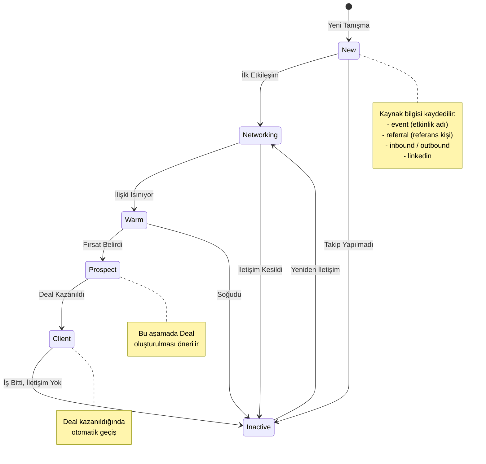
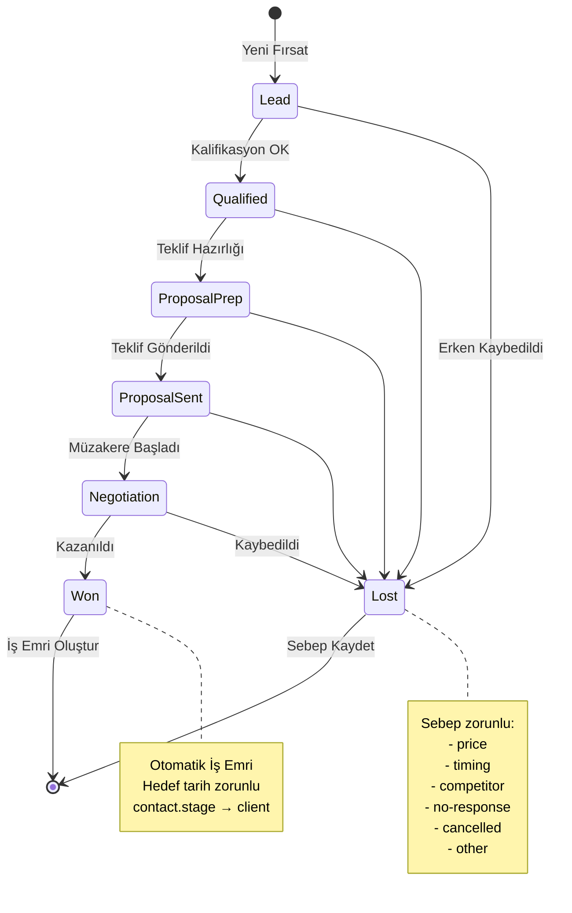
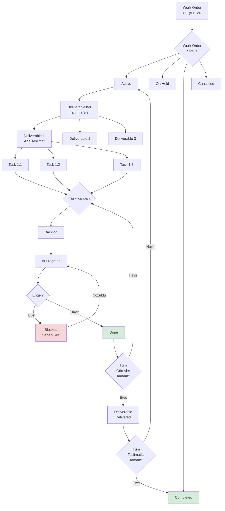
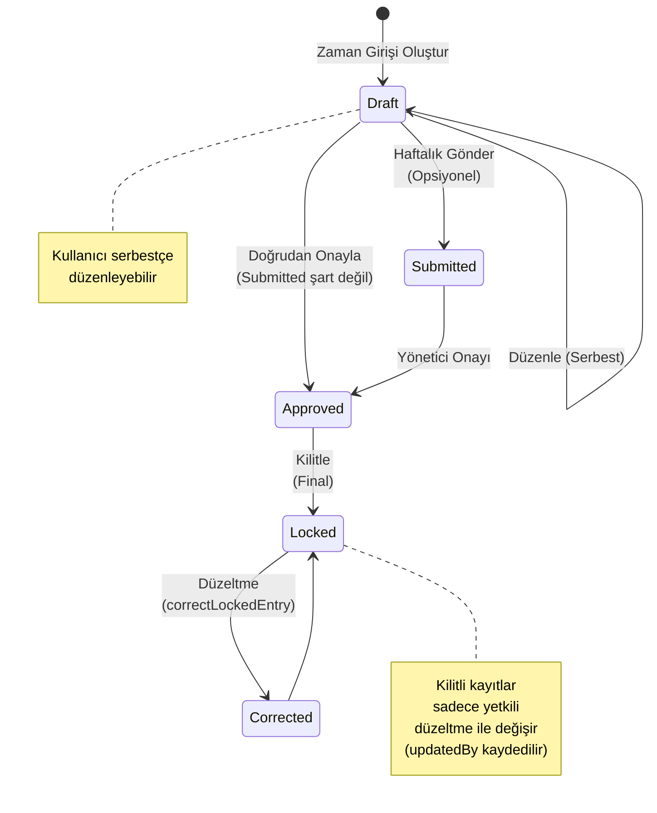
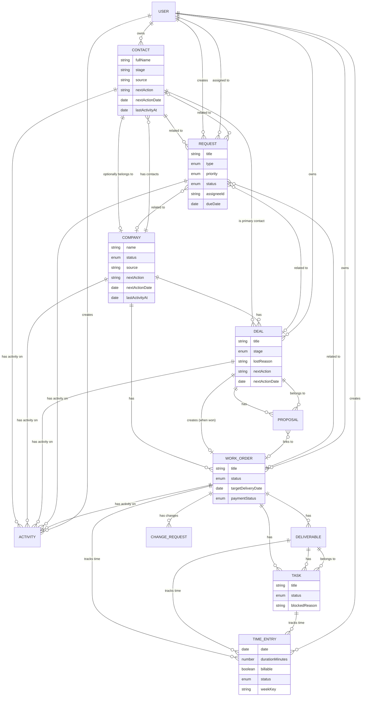
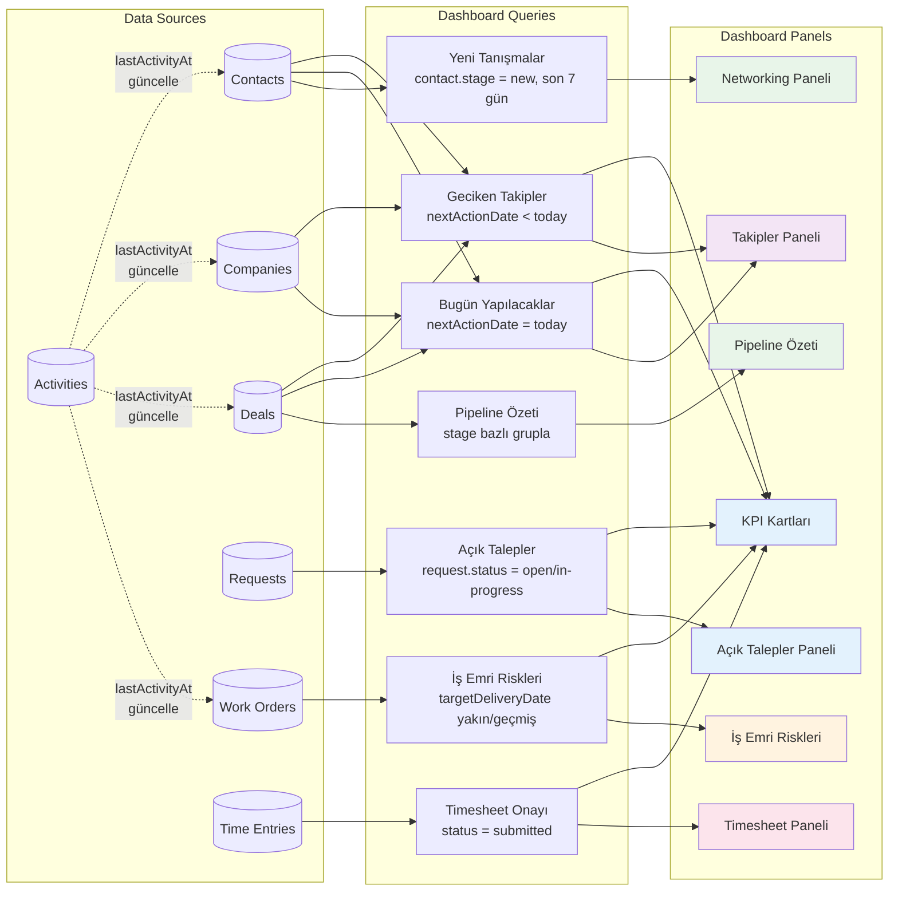

# **Ajans CRM ve İş Takip Uygulaması \- Ürün Tasarım Dokümanı (MVP Odaklı)**

**Tarih:** 06.02.2026
**Versiyon:** 3.0 (Contact-First Yaklaşım + Quick Action + İç Talepler)
**Durum:** Geliştirme - Revizyon
**Sektör:** Yazılım Geliştirme & Dijital Ajans

> Bu doküman, "ileri düzey teknik özellikler" yerine ajansların günlük satış ve müşteri süreçlerini **daha düzenli, takip edilebilir ve kayıpsız** yönetmesini hedefleyen iş odaklı bir tasarım dokümanıdır.

## **1. Proje Özeti ve Vizyon**

Uygulama; yazılım geliştirme hizmeti veren firmaların **müşteri ilişkileri (CRM)**, **teklif yönetimi**, **iş emri / teslimat takibi**, **zaman kaydı** ve **iletişim geçmişini** tek yerde toplar.

Amaç "her şeyi yapmak" değil; ajansın en çok zorlandığı 4 noktayı netleştirmektir:

- **Kayıp bağlantılar** (etkinlikte tanışılan kişi, alınan kartvizit unutuldu/takip edilmedi)
- **Unutulan takipler** (müşteriye dönüş yapılmadı, teklif askıda kaldı)
- **Dağınık iletişim** (notlar WhatsApp/e-posta/defter arasında kayboldu)
- **İşlerin teslimata dönüşmemesi** (kazanılan işin kapsamı belirsiz, görevler dağınık)

### **1.1. Temel Prensipler**

- **Contact-First (Kişi Merkezli) CRM**: Süreç kişiyle tanışmayla başlar; şirket ve fırsat sonra gelir.
- **Next Action (Sonraki Aksiyon) odaklı**: Her kişi, şirket ve iş için tek bir "sonraki adım" net olmalı.
- **Quick Action (Hızlı Giriş)**: Satış yöneticisi 3 tıkla görüşme/not/talep kaydedebilmeli.
- **Tek Activity Feed**: Görüşme, not, dosya, karar ve sonraki adım tek akışta toplanmalı.
- **İş Emri + Teslimat (Deliverable)**: Kazanılan iş "proje" olmak zorunda değil; önce "iş emri" açılır, içinde 3-7 ana teslimat tanımlanır.
- **Basit kanban**: Ajans için karmaşık sprint/R&D yerine, işin akışını görünür kılan basit durumlar.

### **1.2. Kapsam (MVP)**

MVP'nin hedefi: "Tanışma → ilişki → fırsat → teklif → iş → teslimat → zaman kaydı" hattını **uçtan uca** çalıştırmak.

- Kişi yönetimi (bağımsız, şirketsiz olabilir)
- Şirket yönetimi (kişilere bağlanır)
- Satış hunisi (Deal/Pipeline)
- Teklif (kalem, iskonto, KDV, versiyon, PDF)
- İş Emri (Work Order) + Teslimatlar + Görevler
- Activity Feed (kişi, şirket, deal, iş emri bazlı)
- İç Talepler (satış → teknik ekip)
- Quick Action Panel (hızlı giriş)
- Zaman girişi (basit timesheet) + onay/kilitleme

### **1.3. Opsiyonel (MVP Dışı)**

Bu özellikler istenirse sonraya bırakılır:

- Git entegrasyonları ve otomasyonları
- Gantt/timeline ile kaynak planlama
- Offline-first / PWA (kullanıcı ihtiyacına göre)

## **2. Teknoloji Yığını (Basit ve Yeterli)**

- **Frontend**: Next.js 16+ (App Router), TypeScript
- **UI**: Tailwind CSS + shadcn/ui (ve mevcut bileşen seti)
- **Backend**: Firebase (Auth + Firestore + Storage)
- **PDF**: `@react-pdf/renderer` (tek yol seçimi)
- **Deploy**: Vercel

> Not: Uygulama ölçeği büyümedikçe "ekstra altyapı" hedeflenmez. Öncelik; ekranlar ve iş akışının doğruluğudur.

## **3. İş Akışları (Mutlaka Net Olmalı)**

### **3.0. İlişki Yaşam Döngüsü: Tanışma → İlişki → Fırsat**

> **v3.0 ile eklendi.** Satış süreci "lead" ile değil, **kişiyle tanışmayla** başlar.

Kurallar:

- Kişi (Contact) bağımsız oluşturulabilir; şirket bağlamak **zorunlu değildir**.
- Her kişinin bir `stage` (ilişki aşaması) vardır: `new | networking | warm | prospect | client | inactive`
- Kişi üzerinde `nextAction` ve `nextActionDate` ile takip yapılır.
- Kişi bir şirkete bağlandığında, şirket seviyesinde de takip başlar.
- Fırsat (Deal) ancak ilişki olgunlaştığında oluşturulur (contact.stage ≥ prospect önerilir).

**İlişki Aşamaları:**

| Stage | Açıklama | Örnek |
|-------|----------|-------|
| `new` | Yeni tanışıldı, henüz etkileşim yok | Etkinlikte kartvizit alındı |
| `networking` | Aktif ilişki kurma, iş konuşulmamış | Kahve buluşması, LinkedIn bağlantısı |
| `warm` | İyi ilişki var, potansiyel iş sinyali | "Gelecek yıl projemiz var" dedi |
| `prospect` | Somut iş fırsatı belirdi | "Bize teklif verin" dedi |
| `client` | Aktif iş ilişkisi (deal/iş emri var) | Proje devam ediyor |
| `inactive` | İletişim kesildi, dormant | 3+ aydır etkileşim yok |

### **3.1. Satış Akışı: Lead → Deal → Teklif → Kazan/Kaybet**

Kurallar:

- Deal açılmadan şirket/kontak seçilir (ya da hızlıca eklenir).
- Teklif "Gönderildi" olmadan "Kazanıldı" yapılabilir; ancak **Kazanıldı** seçildiğinde sistem kullanıcıyı uyarır:
  - "Teklif kabul kaydı oluşturulsun mu?" (kabul tarihi + kabul eden kişi)
- "Kaybedildi" durumunda **sebep zorunlu**: `price | timing | competitor | no-response | cancelled | other`

### **3.2. Operasyon Akışı: Kazanıldı → İş Emri → Teslimatlar → Görevler**

- Deal kazanıldığında otomatik **Work Order** açılır.
- Work Order içinde 3-7 ana teslimat (Deliverable) tanımlanır.
- Görevler teslimata bağlanır (teslimatsız görev "istisna").
- Basit kanban: `backlog | in-progress | blocked | done`
- "Blocked" için **sebep zorunlu**: `waiting-client | internal-approval | payment | dependency | other`

### **3.3. CRM Takip Akışı: Next Action + Activity**

Her kişi, şirket ve deal için:

- **`nextAction`** (metin)
- **`nextActionDate`** (tarih)
- **`ownerId`** (sorumlu)

Dashboard temel hedefi: "Bugün yapılacaklar, gecikenler, bu hafta yaklaşanlar".

### **3.4. İç Talep Akışı: Satış → Teknik Ekip**

> **v3.0 ile eklendi.**

Satış yöneticisi, görüşme sırasında veya sonrasında teknik ekibe hızlıca talep oluşturabilir:

- Talep (Request) Quick Action Panel üzerinden **3 tıkla** oluşturulur.
- Talep opsiyonel olarak kişi, şirket, deal veya iş emrine bağlanabilir.
- Talep yaşam döngüsü: `open → in-progress → done | cancelled`
- Talep oluşturulduğunda otomatik bir **system activity** kaydedilir.

**Talep Türleri:**

| Tür | Açıklama |
|-----|----------|
| `technical-assessment` | Teknik fizibilite / değerlendirme |
| `demo-setup` | Demo ortamı hazırlığı |
| `cost-estimate` | Maliyet/efor tahmini |
| `design` | Tasarım talebi |
| `content` | İçerik talebi |
| `other` | Diğer |

### **3.5. Zaman Takibi (Basit Timesheet)**

- Zaman kaydı alanları: tarih, süre (dk), iş emri/deliverable/görev bağlama, açıklama, `billable` (E/H).
- Haftalık dönem kapanışı: "Onayla ve kilitle".
- Kilitli kayıt değişecekse "düzeltme kaydı" (not + kim + ne zaman).

### **3.6. İş Akışı Diagramları (Görsel Referans)**

Bu bölüm, yukarıdaki iş akışlarını görsel olarak açıklar ve kullanıcının sistemi anlamasını kolaylaştırır.

#### **3.6.1. Genel Uçtan Uca İş Akışı**

```mermaid
flowchart TD
    Start([Yeni Tanışma]) --> Contact[Kişi Oluştur<br/>şirketsiz olabilir]
    Contact --> Nurture{İlişki Kur}

    Nurture -->|Networking| Activity1[Kahve / Etkinlik / LinkedIn<br/>Activity + Next Action]
    Activity1 --> StageUp1[stage: networking → warm]
    StageUp1 --> CompanyLink{Şirket<br/>Belli mi?}

    CompanyLink -->|Evet| LinkCompany[Şirkete Bağla<br/>veya Şirket Oluştur]
    CompanyLink -->|Henüz Değil| Nurture

    LinkCompany --> OpportunityCheck{Fırsat<br/>Var mı?}
    OpportunityCheck -->|Henüz Yok| Nurture
    OpportunityCheck -->|Evet| Prospect[stage: prospect]

    Prospect --> Deal[Deal Oluştur<br/>stage: lead]

    Deal --> Pipeline{Pipeline'da<br/>İlerlet}
    Pipeline -->|Lead| Qualify[Kalifikasyon]
    Qualify --> PrepProposal[Teklif Hazırla]
    PrepProposal --> Proposal[Teklif Oluştur]
    Proposal --> SendProposal[Teklif Gönder]
    SendProposal --> Negotiation[Müzakere]

    Negotiation --> Decision{Karar?}
    Decision -->|Kazanıldı| Won[Deal: Won<br/>contact.stage → client]
    Decision -->|Kaybedildi| Lost[Deal: Lost<br/>Sebep Seç]

    Won --> AutoWorkOrder[İş Emri Otomatik Oluştur<br/>Hedef Tarih Belirle]
    AutoWorkOrder --> WorkOrder[Work Order]
    WorkOrder --> Deliverables[Teslimatları Tanımla<br/>3-7 ana teslimat]
    Deliverables --> Tasks[Görevleri Oluştur<br/>Teslimat bazlı]

    Tasks --> TaskBoard[Task Kanban]
    TaskBoard --> TimeEntry[Zaman Girişi<br/>İş/Teslimat/Görev]
    TimeEntry --> Submit[Haftalık Gönder]
    Submit --> Approve[Yönetici Onayı]
    Approve --> Lock[Kilitle]
    Lock --> End([Tamamlandı])

    Lost --> End

    %% Quick Action & Requests
    Contact -.->|Quick Action| Request[İç Talep Oluştur<br/>Teknik Ekibe]
    LinkCompany -.->|Quick Action| Request
    Deal -.->|Quick Action| Request

    style Start fill:#e1f5e1
    style End fill:#ffe1e1
    style Won fill:#d4edda
    style Lost fill:#f8d7da
    style AutoWorkOrder fill:#fff3cd
    style Request fill:#e3f2fd
    style Contact fill:#e8f5e9
```



**Açıklama:**
- Süreç **kişiyle tanışmayla** başlar, şirket sonra eklenir
- Her aşamada **Activity Feed** ile iletişim kaydedilir
- Her nesne üzerinde **Next Action** tanımlanır
- Dashboard'da gecikmiş/yaklaşan takipler görünür
- **Quick Action** ile her aşamadan hızlı giriş yapılabilir

#### **3.6.2. Contact İlişki Yaşam Döngüsü**



#### **3.6.3. Deal Pipeline Durum Akışı**



#### **3.6.4. Work Order ve Operasyon Akışı**



**Blocked Sebepleri:**
- `waiting-client`: Müşteri bekleniyor
- `internal-approval`: İç onay bekleniyor
- `payment`: Ödeme bekleniyor
- `dependency`: Bağımlılık var
- `other`: Diğer

#### **3.6.5. Timesheet Durum Akışı**



#### **3.6.6. Veri İlişkileri ve Bağımlılıklar**



**Temel İlişki Kuralları:**
1. **Contact (bağımsız)**: Kişi şirketsiz var olabilir; `companyId` opsiyoneldir
2. **Contact → Company**: Kişi opsiyonel olarak bir şirkete bağlanabilir
3. **Company → Deal**: Bir şirketin birden fazla fırsatı olabilir
4. **Deal → Proposal**: Bir fırsatın birden fazla teklifi (versiyon) olabilir
5. **Deal (Won) → Work Order**: Kazanılan her fırsat **otomatik** bir iş emri oluşturur
6. **Work Order → Deliverable → Task**: Hiyerarşik yapı (3 seviye)
7. **Time Entry**: Work Order, Deliverable veya Task'a bağlanabilir
8. **Activity**: Contact, Company, Deal, Work Order veya Request üzerinde oluşturulur (en az bir bağlam zorunlu)
9. **Request**: Opsiyonel olarak Contact, Company, Deal veya Work Order'a bağlanabilir
10. **Next Action**: Contact, Company ve Deal'da bulunur (takip disiplini)

#### **3.6.7. Dashboard Veri Akışı**



**Dashboard Mantığı:**
- Her panel **limitli sorgu** ile yüklenir (performans)
- `lastActivityAt` alanı **denormalize** edilir (write sırasında güncellenir)
- Smart Nudge'lar basit kurallara dayanır (AI değil, tarih/durum kontrolü)
- **Takipler Paneli**: Contact, Company ve Deal bazlı takipleri birleştirir
- **Networking Paneli**: Yeni tanışmalar ve networking aşamasındaki kişiler
- **Açık Talepler Paneli**: Teknik ekibe açılan taleplerin durumu

## **4. Veri Modeli (Firestore)**

> Amaç; raporlanabilir, basit ve tutarlı bir model. "Her alanı en baştan koymak" yerine, MVP'yi taşıyan alanlar tanımlanır.

### **4.1. Ortak Alanlar**

Tüm koleksiyonlarda önerilen alanlar:

- `createdAt`, `updatedAt` (timestamp)
- `createdBy`, `updatedBy` (ref/users veya uid)
- `isArchived` (boolean)

### **4.2. Koleksiyonlar**

#### **contacts (Kişiler — Birinci Sınıf Varlık)**

> **v3.0 değişikliği:** Contact artık bağımsız bir varlıktır. `companyId` opsiyoneldir. Kendi `stage`, `nextAction`, `lastActivityAt` ve `source` alanlarına sahiptir.

```json
{
  "id": "auto-id",
  "fullName": "string",
  "title": "string",
  "email": "string",
  "phone": "string",

  "companyId": "ref(companies) | null",
  "companyName": "string",

  "stage": "new | networking | warm | prospect | client | inactive",
  "source": "event | referral | inbound | outbound | linkedin | other",
  "sourceDetail": "string",

  "nextAction": "string",
  "nextActionDate": "timestamp",
  "lastActivityAt": "timestamp",
  "ownerId": "ref(users)",

  "isPrimary": "boolean",
  "notes": "string",
  "tags": ["string"]
}
```

**Kurallar:**
- `companyId` opsiyoneldir; kişi şirketsiz oluşturulabilir.
- `companyName` denormalize alandır; şirket bağlandığında otomatik doldurulur.
- `stage` kişinin ilişki yaşam döngüsünü takip eder.
- `source` + `sourceDetail` tanışma kaynağını kaydeder (örn: source=event, sourceDetail="Web Summit 2026").
- Bir şirkette sadece bir kişi `isPrimary=true` olabilir.
- `lastActivityAt` aktivite eklendiğinde otomatik güncellenir.

#### **companies (Müşteri Şirketleri)**

> **v3.0 değişikliği:** `status` genişletildi. `source` ve `sourceDetail` eklendi.

```json
{
  "id": "auto-id",
  "name": "string",
  "status": "prospect | active | inactive | churned",
  "source": "event | referral | inbound | outbound | other",
  "sourceDetail": "string",
  "ownerId": "ref(users)",
  "nextAction": "string",
  "nextActionDate": "timestamp",
  "lastActivityAt": "timestamp",
  "tags": ["string"]
}
```

**Status Açıklamaları:**

| Status | Açıklama |
|--------|----------|
| `prospect` | Potansiyel müşteri, henüz iş yapılmamış |
| `active` | Aktif müşteri (devam eden deal veya iş emri var) |
| `inactive` | Pasif, mevcut iş yok |
| `churned` | Eski müşteri, artık çalışmıyoruz |

#### **deals (Satış Fırsatları / Pipeline Kartı)**

**MVP kuralı:** Deal açarken `primaryContactId` (**contact**) zorunludur.

```json
{
  "id": "auto-id",
  "companyId": "ref(companies)",
  "primaryContactId": "ref(contacts)",
  "title": "string",
  "stage": "lead | qualified | proposal-prep | proposal-sent | negotiation | won | lost",
  "lostReason": "price | timing | competitor | no-response | cancelled | other",
  "expectedCloseDate": "timestamp",
  "estimatedBudgetMinor": "number",
  "currency": "TRY | USD | EUR",
  "ownerId": "ref(users)",
  "nextAction": "string",
  "nextActionDate": "timestamp",
  "lastActivityAt": "timestamp"
}
```

#### **catalog_items (Hizmet/Kalem Kataloğu)**

> Katalog opsiyonel ama tutarlılık için önerilir.

```json
{
  "id": "auto-id",
  "name": "string",
  "type": "service | product | license",
  "unit": "hour | day | month | piece | project",
  "defaultUnitPriceMinor": "number",
  "currency": "TRY | USD | EUR",
  "taxRate": "number",
  "isActive": "boolean",
  "description": "string"
}
```

#### **proposals (Teklifler)**

Karar: Para alanları "minor unit" (kuruş/cent) tutulur.

```json
{
  "id": "auto-id",
  "dealId": "ref(deals)",
  "companyId": "ref(companies)",
  "version": "number",
  "status": "draft | sent | accepted | rejected",
  "currency": "TRY | USD | EUR",
  "pricesIncludeTax": "boolean (default: true)",
  "items": [
    {
      "catalogItemId": "ref(catalog_items)",
      "title": "string",
      "description": "string",
      "quantity": "number",
      "unit": "hour | day | month | piece | project",
      "unitPriceMinor": "number",
      "taxRate": "number"
    }
  ],
  "subtotalMinor": "number",
  "taxTotalMinor": "number",
  "grandTotalMinor": "number",
  "sentAt": "timestamp",
  "acceptedAt": "timestamp",
  "acceptedByName": "string",
  "acceptanceNote": "string"
}
```

#### **work_orders (İş Emirleri)**

> "Proje" yerine "iş emri": ajans işi doğrudan teslimata indirger.

**MVP kuralı:** Work Order oluştururken `targetDeliveryDate` zorunludur.

```json
{
  "id": "auto-id",
  "companyId": "ref(companies)",
  "dealId": "ref(deals)",
  "proposalId": "ref(proposals)",
  "title": "string",
  "status": "active | on-hold | completed | cancelled",
  "startDate": "timestamp",
  "targetDeliveryDate": "timestamp",
  "ownerId": "ref(users)",
  "scopeSummary": "string",
  "paymentStatus": "unplanned | deposit-requested | deposit-received | invoiced | paid"
}
```

#### **deliverables (Teslimatlar)**

```json
{
  "id": "auto-id",
  "workOrderId": "ref(work_orders)",
  "title": "string",
  "status": "not-started | in-progress | blocked | delivered | approved",
  "targetDate": "timestamp",
  "notes": "string"
}
```

#### **tasks (Görevler)**

```json
{
  "id": "auto-id",
  "workOrderId": "ref(work_orders)",
  "deliverableId": "ref(deliverables)",
  "title": "string",
  "status": "backlog | in-progress | blocked | done",
  "blockedReason": "waiting-client | internal-approval | payment | dependency | other",
  "assigneeId": "ref(users)",
  "dueDate": "timestamp"
}
```

#### **activities (İletişim ve Not Akışı)**

> **v3.0 değişikliği:** `contactId` ve `requestId` eklendi. `type`'a `networking` eklendi. Tüm referans alanları opsiyoneldir ancak **en az biri dolu olmalıdır**.

```json
{
  "id": "auto-id",
  "contactId": "ref(contacts) | null",
  "companyId": "ref(companies) | null",
  "dealId": "ref(deals) | null",
  "workOrderId": "ref(work_orders) | null",
  "requestId": "ref(requests) | null",
  "type": "call | meeting | email | note | file | decision | networking | system",
  "source": "user | system",
  "systemEvent": "string (opsiyonel)",
  "summary": "string",
  "details": "string",
  "nextAction": "string",
  "nextActionDate": "timestamp",
  "occurredAt": "timestamp",
  "createdBy": "ref(users)"
}
```

**Bağlam referansları (validation kuralı):**

| Alan | Zorunlu mu? | Açıklama |
|------|-------------|----------|
| `contactId` | Opsiyonel | Kişi bazlı aktivite |
| `companyId` | Opsiyonel | Şirket bazlı aktivite |
| `dealId` | Opsiyonel | Deal bazlı aktivite |
| `workOrderId` | Opsiyonel | İş emri bazlı aktivite |
| `requestId` | Opsiyonel | Talep bazlı aktivite |

**Kural:** En az bir referans alanı dolu olmalıdır. Birden fazla aynı anda dolu olabilir (örn: contactId + companyId + dealId).

**Aktivite sayılan olaylar (MVP):** Aşağıdakiler "aktivite var/yok" kurallarında sayılır ve ilgili kaydın `lastActivityAt` alanını günceller.

- Call
- Call attempt / Ulaşılamadı
- Meeting
- Networking (etkinlik, tanışma, kahve)
- Email sent/received
- WhatsApp/Chat özeti
- Note (iç not)
- Decision
- Deal stage değişti
- Proposal sent
- Proposal accepted/rejected
- Work Order status değişti
- Deliverable status değişti
- Request oluşturuldu/tamamlandı

**`lastActivityAt` güncelleme hedefi (MVP):**

- Contact üzerinde: `contactId` bulunan aktiviteler
- Company üzerinde: `companyId` bulunan aktiviteler
- Deal üzerinde: `dealId` bulunan aktiviteler + "deal stage değişti" olayı
- Work Order üzerinde: `workOrderId` bulunan aktiviteler + status/deliverable durum değişimleri

**MVP kararı (net kural \- "kodlanınca doğrudan iş bitsin"):**

Yukarıdaki "aktivite sayılan" maddelerin **tamamı** `activities` koleksiyonuna bir kayıt olarak düşer.

- Kullanıcının manuel ekledikleri: `source="user"` ve `type` ilgili değerlerden biri (`call/meeting/email/note/decision/file/networking`).
- Sistem olayları: `source="system"` ve `type="system"` kullanır.

Önerilen `systemEvent` değerleri:

- `call_attempt` (Call attempt / Ulaşılamadı)
- `chat_summary` (WhatsApp/Chat özeti)
- `deal_stage_changed`
- `proposal_sent`
- `proposal_accepted`
- `proposal_rejected`
- `work_order_status_changed`
- `deliverable_status_changed`
- `request_created`
- `request_completed`
- `contact_stage_changed`

> Not: Bu yaklaşım ile "aktivite" hesabı ve timeline/aktivite akışı %100 aynı kaynaktan beslenir; implementasyonda yorum kalmaz.

#### **requests (İç Talepler)**

> **v3.0 ile eklendi.** Satış yöneticisinin teknik ekibe hızlıca talep oluşturmasını sağlar.

```json
{
  "id": "auto-id",
  "title": "string",
  "description": "string",
  "type": "technical-assessment | demo-setup | cost-estimate | design | content | other",
  "priority": "low | normal | urgent",
  "status": "open | in-progress | done | cancelled",
  "requesterId": "ref(users)",
  "assigneeId": "ref(users)",

  "contactId": "ref(contacts) | null",
  "companyId": "ref(companies) | null",
  "dealId": "ref(deals) | null",
  "workOrderId": "ref(work_orders) | null",

  "dueDate": "timestamp",
  "resolution": "string"
}
```

**Kurallar:**
- `requesterId` otomatik doldurulur (talebi oluşturan).
- `assigneeId` talep oluşturulurken seçilir (atanan kişi).
- Tüm bağlam referansları (contactId, companyId, dealId, workOrderId) opsiyoneldir.
- Talep oluşturulduğunda otomatik bir system activity kaydedilir (`systemEvent: request_created`).
- Talep tamamlandığında otomatik bir system activity kaydedilir (`systemEvent: request_completed`).
- `resolution` alanı talep tamamlandığında sonucu özetler.

#### **time_entries (Zaman Girişleri)**

```json
{
  "id": "auto-id",
  "userId": "ref(users)",
  "workOrderId": "ref(work_orders)",
  "deliverableId": "ref(deliverables)",
  "taskId": "ref(tasks)",
  "date": "timestamp",
  "durationMinutes": "number",
  "billable": "boolean",
  "note": "string",
  "weekKey": "string (Örn: 2026-W05)",
  "status": "draft | submitted | approved | locked"
}
```

**Timesheet akışı (MVP):**

- `draft`: zaman girişi serbestçe düzenlenebilir.
- `submitted`: opsiyonel ara adım (gönderdim/incelemeye hazır).
  - **submitted şart değildir** (draft'tan doğrudan approved'a geçilebilir).
- `approved`: onaylandı.
- `locked`: kilitli (sonradan değişiklik yapılmaz; hata varsa yeni bir "düzeltme" time entry eklenir).

**Geçişler (önerilen):**

- `draft → submitted` (opsiyonel)
- `draft → approved` (submitted şart değil)
- `submitted → approved`
- `approved → locked` (final)

#### **change_requests (Kapsam Değişiklikleri \- Opsiyonel ama önerilir)**

```json
{
  "id": "auto-id",
  "workOrderId": "ref(work_orders)",
  "title": "string",
  "description": "string",
  "impact": "low | medium | high",
  "status": "draft | sent | approved | rejected",
  "approvedAt": "timestamp",
  "approvedByName": "string"
}
```

## **5. Quick Action Panel (Hızlı Giriş)**

> **v3.0 ile eklendi.** Satış yöneticisinin her ekrandan hızlıca veri girmesini sağlayan FAB (Floating Action Button) bileşeni.

### **5.1. Erişim**

Her ekranda sağ alt köşede sabit bir `[+]` butonu bulunur. Tıklandığında Quick Action menüsü açılır:

- **Görüşme Kaydet** — Arama/toplantı/networking notu
- **Hızlı Not** — Kısa not
- **Takip Planla** — nextAction + tarih
- **Talep Oluştur** — Teknik ekibe iç talep

### **5.2. Hızlı Aktivite Formu**

**Tasarım prensipleri:**
- **3 tıkla kaydet**: Tür seç → kişi/şirket seç → özet yaz → kaydet
- **Son kullanılanlar üstte**: Son etkileşim kurulan 5 kişi/şirket arama sonuçlarının başında gösterilir
- **Akıllı varsayılanlar**: Bugünün tarihi, aktif kullanıcı otomatik atanır
- **nextAction teşviki**: Kaydetmeye basınca "Sonraki adım eklemek ister misiniz?" uyarısı gösterilir

### **5.3. Hızlı Talep Formu**

Minimal alanlar:
1. Başlık (zorunlu)
2. Tür (seçmeli)
3. Bağlam — kişi/şirket/deal (opsiyonel, aranabilir)
4. Öncelik (varsayılan: normal)
5. Atanan kişi (seçmeli)
6. Hedef tarih (opsiyonel)
7. Açıklama (opsiyonel)

## **6. Roller ve Yetkilendirme (Basit RBAC)**

**MVP kararı:** Bu aşamada sistemde sadece **tek rol/kullanıcı: `admin`** olacaktır.

- İzin matrisi ve RBAC detayları MVP kapsamı dışındadır.
- Timesheet akışı (submitted → approved → locked) için **özel yetki kuralı uygulanmaz**.

## **7. UI/UX ve Ekranlar (Referans)**

UI/UX standartları ve ekran/rota listesi bu dokümandan ayrıştırılmıştır:

- UI/UX ve ekran spesifikasyonu: `docs/02-UI-UX.md`
- Dashboard detayları: `docs/01-Dashboard.md`

## **8. MVP Yol Haritası (İş Akışına Göre)**

### **Faz 0: Contact-First Dönüşüm (YENİ)**

- Contact veri modeli revizyonu (stage, source, nextAction, lastActivityAt, ownerId)
- Company veri modeli revizyonu (status genişletme, source/sourceDetail)
- Activity veri modeli revizyonu (contactId, requestId, networking type)
- Contact servisi güncelleme
- Company servisi güncelleme
- Activity servisi güncelleme
- Contact listesi ve form UI güncelleme
- Company form UI güncelleme
- Dashboard: Contacts bazlı takip entegrasyonu

### **Faz 0.5: İç Talepler + Quick Action (YENİ)**

- Requests koleksiyonu ve servisi oluşturma
- Quick Action Panel (FAB) bileşeni
- Hızlı Aktivite Formu
- Hızlı Talep Formu
- Dashboard: Networking Paneli
- Dashboard: Açık Talepler Paneli

### **Faz 1: CRM Temeli**

- Şirket/kontak CRUD
- Deal pipeline + stage kuralları + next action alanları
- Activity feed (contact + company + deal)

### **Faz 2: Teklif**

- Katalog (opsiyonel) + teklif kalemleri
- KDV + versiyon + PDF
- Teklif kabul kaydı ve deal "won/lost" akışı

### **Faz 3: Operasyon (İş Emri)**

- Deal won → work order oluştur
- Deliverable + task yönetimi + basit kanban
- Activity feed (work order)

### **Faz 4: Zaman Takibi**

- Time entry (haftalık)
- Onay/kilitleme
- Basit rapor: tahmini vs gerçekleşen (saat bazında)
