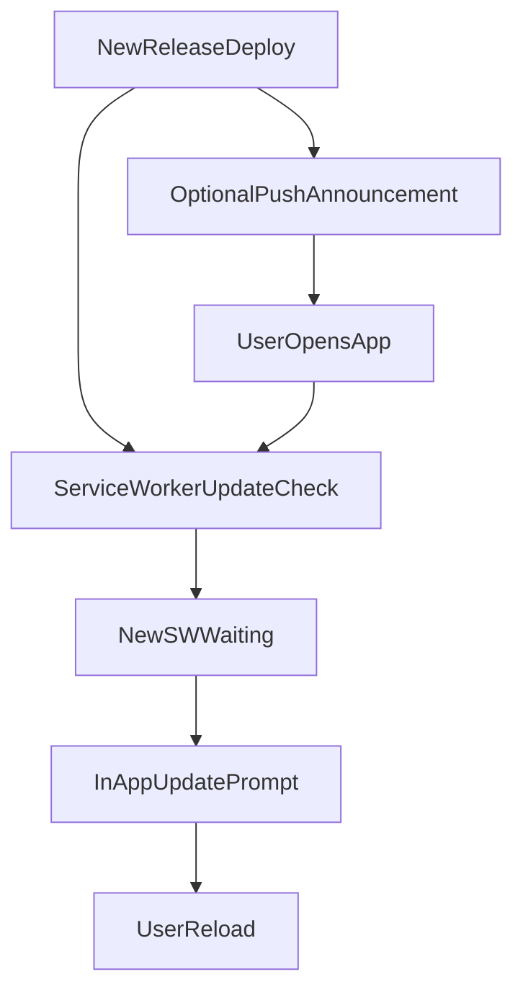

# Uygulama Güncelleme ve Sürüm Bildirimi (Web + PWA)

Bu doküman, Simetri Planner projesinde yeni sürüm yayınlandığında kullanıcıya nasıl bildirim verileceğini ve hangi yöntemin ne için doğru olduğunu açıklar.

## Kısa Cevap

- Uygulama içinde "Yeni sürüm hazır, sayfayı yenile" uyarısı için **ana yöntem Service Worker update akışıdır**.
- Push notification bu senaryoda **yardımcı yöntemdir** (kullanıcı uygulamada değilken duyuru için).
- "Zorunlu olarak yeni dosyaları kullan" davranışı push ile değil, **SW lifecycle + cache yönetimi** ile sağlanır.

## Mevcut Proje Durumu

Projede gerekli temel yapı zaten mevcut:

- PWA eklentisi: `next-pwa` (`next.config.mjs`)
- SW import: `importScripts: ["/push-sw.js"]` (`next.config.mjs`)
- Push event handler: `public/push-sw.js`
- Subscription endpoint: `app/api/push/subscribe/route.ts`
- Push send endpoint: `app/api/push/send/route.ts`
- VAPID env alanları: `.env.example`

## Hangi İhtiyaç İçin Hangi Yöntem?

### 1) Aktif kullanıcıya "Yenile" uyarısı

Doğru yöntem:

- Service Worker'ın yeni sürüme geçtiğini tespit et
- UI'da toast/banner göster
- Kullanıcı "Yenile" dediğinde `window.location.reload()` çağır

Neden:

- Kullanıcı zaten uygulamada aktifken en güvenilir yöntem budur
- Push izni olmasa bile çalışır

### 2) Uygulama kapalıyken sürüm duyurusu

Doğru yöntem:

- Push notification gönder
- Bildirime tıklanınca uygulamayı aç (`notificationclick`)

Neden:

- Kullanıcıyı uygulamaya geri çağırır
- Ama tek başına cache geçişini garanti etmez

## Önerilen Mimari



## Uygulama İçi Update Prompt Akışı

Uygulamada hedef davranış:

1. Uygulama açıldığında `navigator.serviceWorker` kaydını izle.
2. Yeni SW `installed`/`waiting` olduğunda "Yeni sürüm hazır" mesajı göster.
3. Kullanıcı onay verirse sayfayı yenile.
4. Yenileme sonrası yeni static asset'ler yüklenir.

Not:

- `next-pwa` ile `skipWaiting: true` açık olduğunda aktivasyon daha hızlı olur.
- Buna rağmen kullanıcı tarafında UI bildirimi göstermek gerekir.

## Push Bildirimi ile Sürüm Duyurusu

Push payload örneği:

```json
{
  "title": "Yeni sürüm yayınlandı",
  "body": "Performans ve hata düzeltmeleri var. Güncellemek için uygulamayı açın.",
  "url": "/dashboard",
  "type": "app-update"
}
```

Service Worker'da zaten bulunan `notificationclick` akışı ile kullanıcı ilgili route'a yönlendirilebilir.

## Web (PWA Olmasa Bile) Sürüm Kontrolü

PWA dışında, düz web oturumları için opsiyonel yaklaşım:

- `buildId` veya `appVersion` dönen küçük bir endpoint oluştur (`/api/version` gibi)
- İstemcide 2-5 dakikada bir kontrol et
- Değişim varsa "Yeni sürüm mevcut" banner göster

Bu yöntem, bildirim izni gerektirmez.

## Release Sürecine Önerilen Entegrasyon

1. Deploy tamamlanır.
2. (Opsiyonel) Tüm push abonesi kullanıcılara "yeni sürüm" duyurusu gönderilir.
3. Aktif oturumlarda SW update prompt otomatik görünür.
4. Kritik hotfix durumunda banner mesajı "Lütfen yenileyin" şeklinde daha belirgin yapılır.

## Dikkat Edilecek Noktalar

- Dev ortamında PWA kapalı olabilir (`disable: process.env.NODE_ENV === "development"`); testleri prod benzeri ortamda yap.
- Push çalışması için HTTPS gerekir (localhost hariç).
- iOS/Safari push ve PWA davranışları platforma göre farklı olabilir; gerçek cihaz testi zorunludur.
- Push gönderimi başarısızlıklarını logla ve geçersiz subscription kayıtlarını temizle.

## Test Checklist

- [ ] Kullanıcı bildirim iznini verdikten sonra subscription kaydı oluşuyor.
- [ ] Push gönderildiğinde cihazda sistem bildirimi görünüyor.
- [ ] Bildirime tıklayınca uygulama doğru URL'e açılıyor.
- [ ] Yeni deploy sonrası aktif oturumda "Yeni sürüm hazır" uyarısı çıkıyor.
- [ ] "Yenile" aksiyonundan sonra yeni sürüm asset'leri yükleniyor.
- [ ] iOS Safari + Android Chrome üzerinde davranış doğrulanıyor.

## Sonuç

Bu projede en doğru model:

- **Birincil:** Service Worker update prompt (uygulama içi güvenilir güncelleme akışı)
- **İkincil:** Push notification (uygulama kapalıyken sürüm duyurusu)

Bu iki yaklaşım birlikte kullanıldığında hem web hem PWA kullanıcı deneyimi tutarlı olur.
